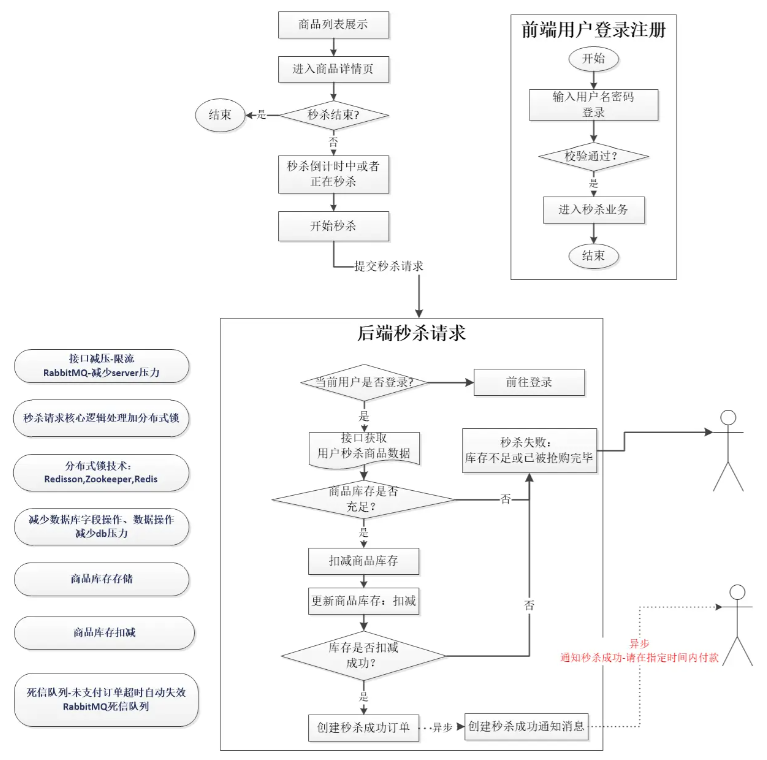

# debug-Seckill

> 本项目是基于SpringBoot+RocketMQ+Zookeeper实现的分布式抢购系统

## 快速启动

1.首先需要在本地开发环境启动Redis、ZooKeeper服务（假设整套系统连接的服务是本地的）:双击Redis、ZooKeeper-Windows简化安装版的bin目录，Redis找寻redis-server.exe，ZooKeeper找寻zkServer.cmd文件，双击即可启动相应的服务
2.将数据库的DDL，即db_second_kill.sql导入到你本地数据库中（前提是你得先建好数据库db_second_kill）
3.将项目从码云check出来，并import进IDEA中，调整IDEA的maven仓库指向，最终将所需要的jar包都下载下来！(如果有一些Jar下载不下来，自己检查一下网络原因跟maven仓库原因吧!)
4.修改application.properties配置文件中相应的配置信息，比如数据库连接信息等等；
5.将系统运行在Tomcat服务器上，观察控制台的输出信息，如果没有报错，那么运行之后一般会自动跳转至首页！
6.最后，可以开心的玩耍了！

## 项目架构

## 业务逻辑

## 数据库表

